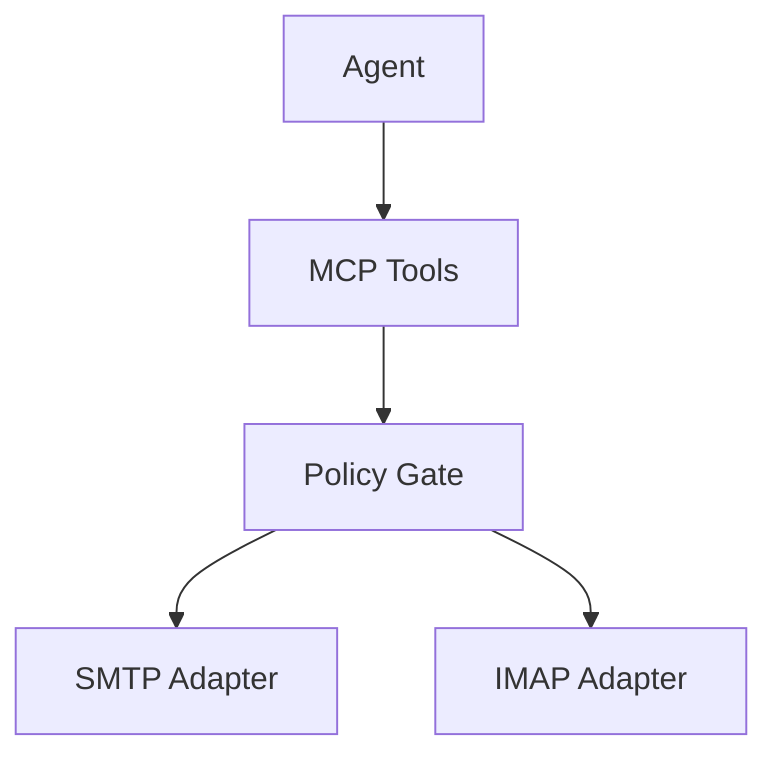

# User guide

## Table of contents

- [What this skill does](#what-this-skill-does)
- [Quick start](#quick-start)
- [Common workflows](#common-workflows)
- [What happens on blocked actions](#what-happens-on-blocked-actions)
- [Secure workflows](#secure-workflows)

## What this skill does

This skill gives an agent controlled access to delegated mail accounts over SMTP and IMAP. It can read messages, send messages, organize folders, and run mailbox mutation actions through policy-aware MCP tools.

## Quick start

1. Define account entries in `_localsetup/config/mail_accounts.json`.
2. Define policy rules in `_localsetup/config/mail_protocol_policy.yaml`.
3. Export account credentials as environment variables.
4. Call tools through `mcp_server.py`.

## Architecture at a glance



## Common workflows

### List accounts

```json
{
  "tool": "mail_accounts_list",
  "args": {}
}
```

### Query latest inbox items

```json
{
  "tool": "mail_query",
  "args": {
    "acct": "support",
    "mailbox": "INBOX",
    "query": "UNSEEN",
    "lim": 25
  }
}
```

### Fetch one message with body

```json
{
  "tool": "mail_get",
  "args": {
    "acct": "support",
    "mailbox": "INBOX",
    "id": "2142",
    "detail": true
  }
}
```

### Send a reply

```json
{
  "tool": "mail_send",
  "args": {
    "acct": "support",
    "from": "help@example.com",
    "to": ["customer@example.com"],
    "subject": "Re: Ticket update",
    "body": "Thanks for the follow-up. Here is the current status."
  }
}
```

### Fetch an attachment chunk

```json
{
  "tool": "mail_get_attachment",
  "args": {
    "acct": "support",
    "mailbox": "INBOX",
    "id": "2142",
    "attachment_index": 0,
    "offset": 0,
    "chunk_size": 262144
  }
}
```

## Secure workflows

### Encrypt then send

Use `mail_send_encrypted` when the receiving agent expects encrypted payload transport.

### Fetch then decrypt

Use `mail_get_decrypted` to retrieve secure payloads and return decrypted envelope data.

## What happens on blocked actions

When policy does not allow an action, the tool returns:

```json
{
  "ok": false,
  "code": "ACTION_BLOCKED",
  "message": "policy_deny"
}
```

If confirmation is needed for a high-impact action, the tool returns:

```json
{
  "ok": false,
  "code": "CONFIRMATION_REQUIRED",
  "message": "Confirmation required. token=... expires_at=..."
}
```

