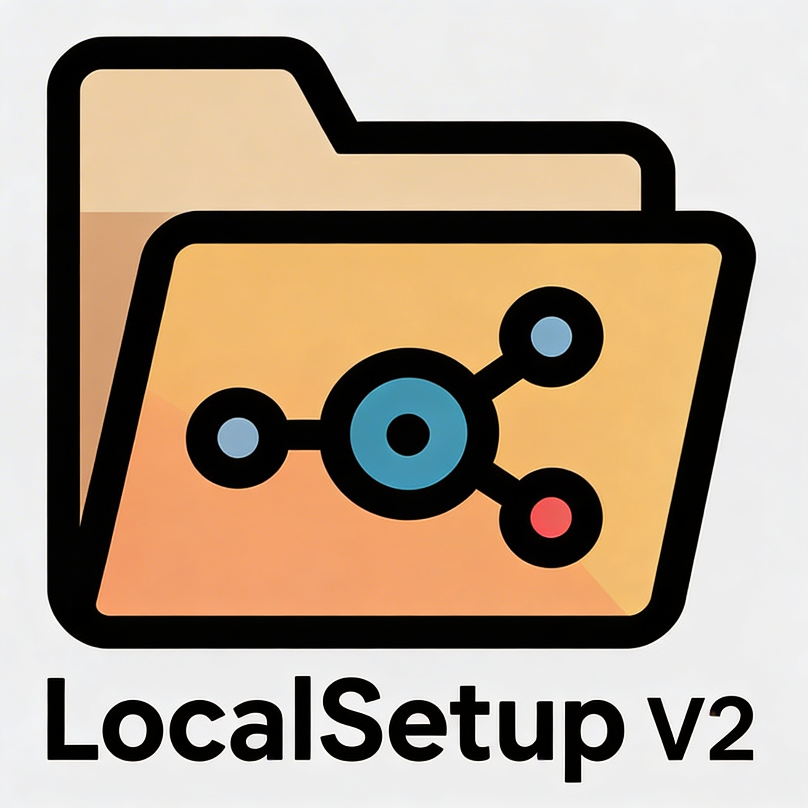

# Localsetup v2

<p align="center">
  
</p>

<p align="center">
  <a href="LICENSE"></a>
  <a href="https://agentskills.io/specification"></a>
  <a href="_localsetup/docs/PLATFORM_REGISTRY.md"></a>
</p>

**Version:** 2.3.2  
**Last updated:** 2026-02-19

Localsetup v2 is a portable, repo-local workflow engine for AI agents. Everything the agent needs, context files, skills, and docs, lives under a single folder in your project. Clone or move the repo and the entire setup moves with it; no home-directory state, no cloud dependency, no hidden drift. The framework installs with one command and works identically across Cursor, Claude Code, OpenAI Codex CLI, and OpenClaw. Add more platforms later by editing one registry file.

Agent behavior tends to drift because context lives outside the repo and nobody can audit what changed. Localsetup fixes that by treating context as code. Every spec, outcome, and workflow decision can reference a git commit, so you get full traceability without extra tooling. Built-in skills cover structured PRD processing, decision-tree prompting, compliance checklists, and human-in-the-loop gates for anything that requires sudo or manual confirmation.

Out of the box you get 32 curated skills: debugging helpers, TDD scaffolding, PR review, git recovery, Linux patching, Ansible orchestration, and more. Skills follow the Agent Skills specification, which means you can import skills from other ecosystems (including Anthropic's public skills repo) and export your own. Framework version and docs are maintained by the repository maintainers; see docs/VERSIONING.md.

In practice, you run a single install command, verify with one script, and start invoking workflows immediately. No lengthy onboarding, no manual config sync, just a working agent setup that stays accurate over time.

## 📊 Current snapshot

<!-- facts-block:start -->
| Fact | Value |
|---|---|
| Current version | `2.3.2` |
| Supported platforms | `cursor, claude-code, codex, openclaw` |
| Shipped skills | `32` |
| Source | `_localsetup/docs/_generated/facts.json` |
<!-- facts-block:end -->

## 🚀 60-second quickstart

Run from your project root. The installer prompts for directory and platform, so you do not need to memorize flags.

### Linux and macOS (Bash)

```bash
curl -sSL https://raw.githubusercontent.com/cptnfren/localsetup/main/install | bash
```

### Windows (PowerShell)

```powershell
& ([scriptblock]::Create((irm https://raw.githubusercontent.com/cptnfren/localsetup/main/install.ps1)))
```

The installer asks which platform(s) to deploy: Cursor, Claude Code, Codex CLI, or OpenClaw. After install, run the verification script printed at the end to confirm context loaded correctly.

For non-interactive one-liners (CI, automation, or when you already know the platform), see the collapsed **Full install reference** below or [_localsetup/docs/QUICKSTART.md](_localsetup/docs/QUICKSTART.md).

### Minimum requirements

- Required:
  - `git >= 2.20.0`
- Recommended for full framework tooling:
  - `python >= 3.10`
  - Python module `yaml` (`PyYAML>=6.0`)

The installer runs a dependency preflight and prints missing items with copy-paste install suggestions before proceeding.

## ⚡ Top 10 features

1. **Secure skill import with safety checks** - import any external skill or freeform text, run automatic prompt-injection detection, foreign-language screening, and heuristic security analysis before it touches your agent. Use the framework as a sandbox to build and adapt workflows however you see fit.
2. **Repo-local engine** - the entire framework lives at `_localsetup/`; clone or move your repo and everything travels together. No home-directory state, no cloud sync, no hidden drift.
3. **Multi-platform install** - one command deploys context and skills for Cursor, Claude Code, Codex CLI, or OpenClaw. Add platforms later by editing one registry file.
4. **Agent Skills spec compatible** - skills follow the open Agent Skills specification, so you can import from Anthropic's public repo, awesome lists, or your own library and export yours for others.
5. **32 shipped skills** - debugging, TDD, PR review, git recovery, Linux patching, Ansible orchestration, tmux handoff, PRD batching, decision trees, and more, ready to use out of the box.
6. **Human-in-the-loop gates** - tmux shared sessions, sudo discovery, and approval flow before destructive ops. The agent pauses and waits for you when it matters.
7. **Versioning** - VERSION at repo root; conventional commits; version and docs are maintained by repo maintainers (see docs/VERSIONING.md).
8. **Skill metadata patching** - staged `SKILL.md` files get their `metadata.version` incremented automatically so skill docs stay accurate.
9. **Platform registry** - a single Markdown table defines every supported host, context path, and skills path. Extend support by editing one file.
10. **Git-coupled traceability** - PRDs, specs, and outcomes can reference commit hashes for audit. Context is code; changes are reviewable.

The full feature catalog contains additional capabilities. See [_localsetup/docs/FEATURES.md](_localsetup/docs/FEATURES.md) for details.

## 🛠️ Top 10 shipped skills

1. `localsetup-debug-pro` - systematic debugging methodology with language-specific commands.
2. `localsetup-test-runner` - write and run tests across frameworks (pytest, Jest, Vitest, Playwright).
3. `localsetup-pr-reviewer` - automated PR review with diff analysis, lint, and structured reports.
4. `localsetup-unfuck-my-git-state` - staged recovery for broken HEAD, phantom worktrees, missing refs.
5. `localsetup-linux-patcher` - automated server patching and Docker container updates.
6. `localsetup-ansible-skill` - playbook-driven provisioning and multi-host orchestration.
7. `localsetup-decision-tree-workflow` - reverse-prompt process: one question at a time, four options, rationale.
8. `localsetup-tmux-shared-session-workflow` - human-in-the-loop ops via shared tmux session.
9. `localsetup-skill-importer` - import external skills from URL or local path with security screening.
10. `localsetup-humanizer` - remove AI-writing patterns from text based on Wikipedia cleanup guide.

The generated shipped skills catalog lists all 32 skills with descriptions and versions. See [_localsetup/docs/SKILLS.md](_localsetup/docs/SKILLS.md).

## 📚 Read more

- [Framework docs index](_localsetup/docs/README.md)
- [Framework README](_localsetup/README.md)
- [Platform registry](_localsetup/docs/PLATFORM_REGISTRY.md)
- [Workflow registry](_localsetup/docs/WORKFLOW_REGISTRY.md)
- [Skill importing](_localsetup/docs/SKILL_IMPORTING.md)
- [Skill discovery](_localsetup/docs/SKILL_DISCOVERY.md)
- [Contributing](CONTRIBUTING.md)
- [Security](SECURITY.md)

<details>
<summary>Full install reference</summary>

### Interactive installers

```bash
curl -sSL https://raw.githubusercontent.com/cptnfren/localsetup/main/install | bash
```

```powershell
& ([scriptblock]::Create((irm https://raw.githubusercontent.com/cptnfren/localsetup/main/install.ps1)))
```

### Non-interactive tool IDs

- `cursor`
- `claude-code`
- `codex`
- `openclaw`

### Examples

```bash
./install --directory . --tools cursor,claude-code --yes
```

```powershell
.\install.ps1 -Directory . -Tools "cursor,claude-code" -Yes
```

### Update behavior

Re-run install with the same tool selection. Installer fetches latest framework source, performs an upgrade-aware sync in `_localsetup/`, writes an upgrade report under `_localsetup/.localsetup-meta/`, then deploys platform files again.

Upgrade policy (optional):

- `--upgrade-policy preserve` (default): keep local customizations when possible.
- `--upgrade-policy force`: overwrite managed files with upstream.
- `--upgrade-policy fail-on-conflict`: abort upgrade if both local and upstream changed the same managed file.

Example:

```bash
./install --directory . --tools cursor --yes --upgrade-policy fail-on-conflict
```

</details>

## 📜 License

Localsetup is released under the [MIT License](LICENSE).

---

<p align="center">
<strong>Author:</strong> <a href="https://github.com/cptnfren">Slavic Kozyuk</a><br>
<strong>Copyright</strong> © 2026 <a href="https://www.cruxexperts.com/">Crux Experts LLC</a> – Innovate, Automate, Dominate.
</p>
